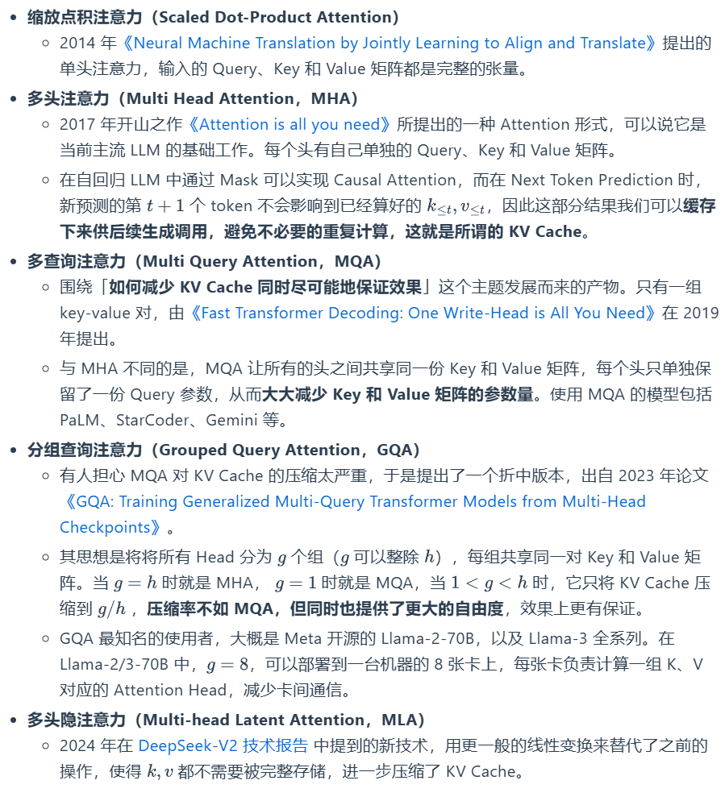
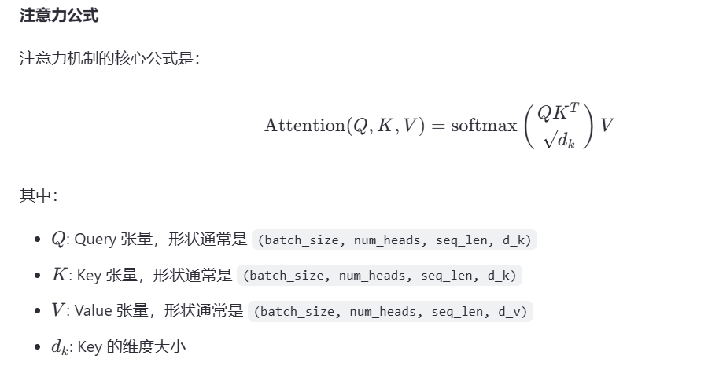
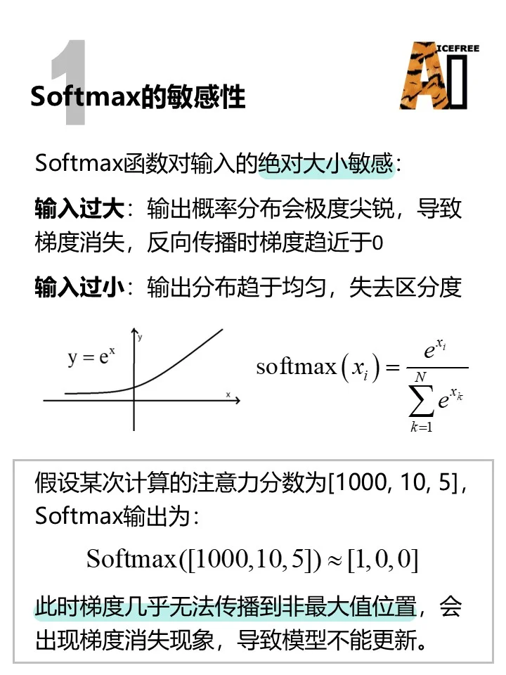
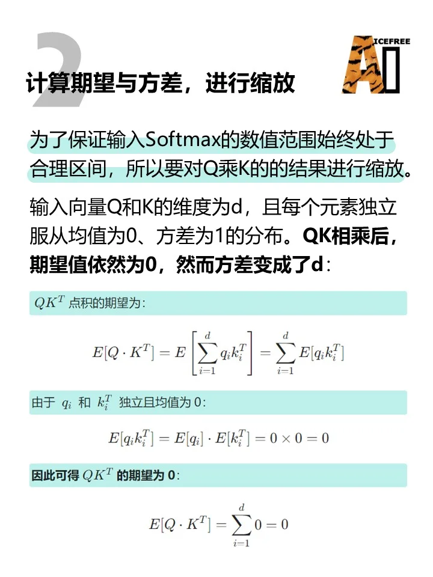
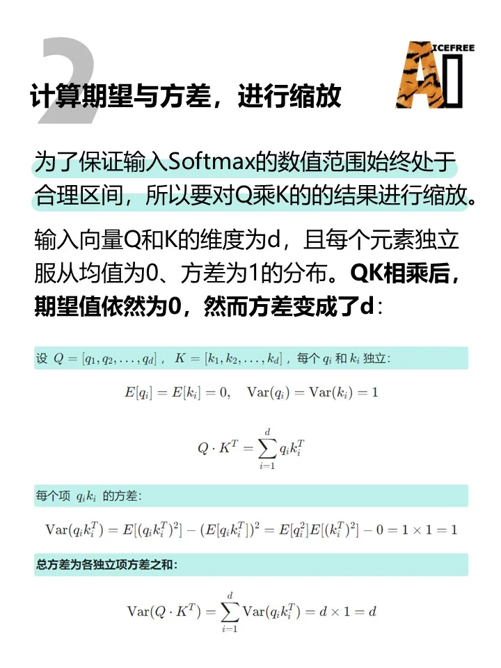
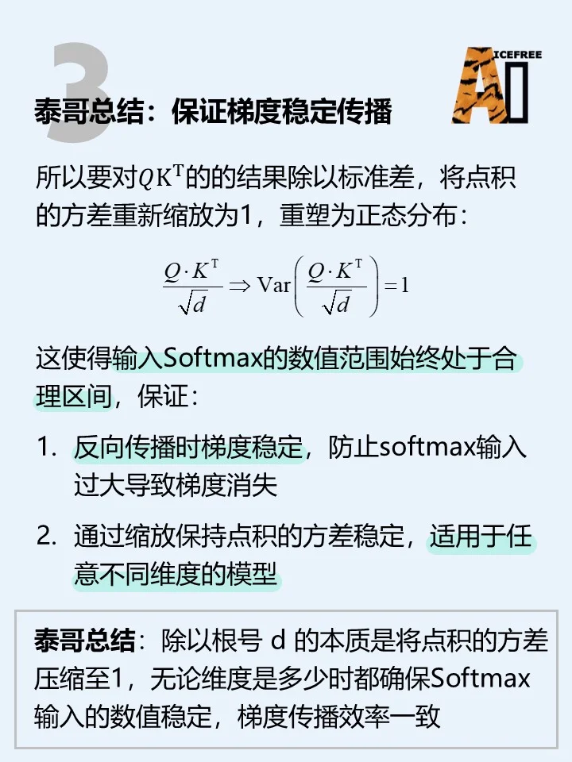
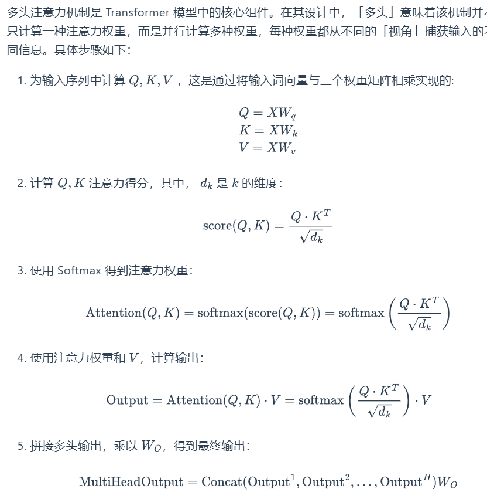
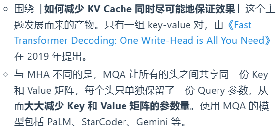
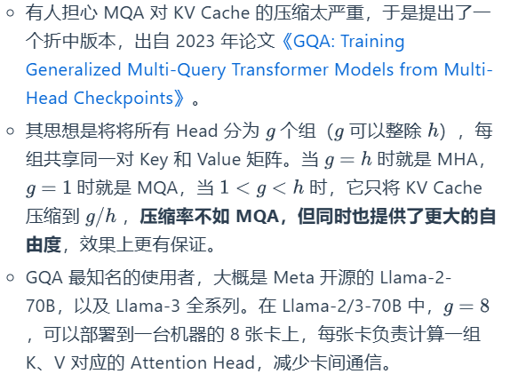

# Ref:
https://hwcoder.top/Manual-Coding-1
LLM from Scartch
# 分类

## 缩放点积注意力（SDPA）

### QA
Q1: 自注意力是什么？
A1: 在自注意力机制中，query、key 和 value 都**来自同一个输入序列的不同表示**。它允许模型在处理序列数据时关注到序列中的其他位置的信息，从而更好地编码当前位置的特征。

Q2: 自注意力计算过程中，Softmax前为什么要除以根号d？
A2: 

Q2_续: 为什么q和k的元素独立且服从(0，1)正态分布？
A2: 自注意力操作前经过了LN或者RMSNorm。

Q2_续: 分布都化标准正态分布有什么好处？
A2: 为了让梯度稳定传播

## 多头注意力（MHA）
  
Q3: 在split_head方法中，使用reshape后接transpose而非直接reshape到(batch_size, num_heads, seq_len, head_dim)是为什么？  
A3: 参考这篇文章

## 多查询注意力注意力（MQA）

## 分组查询注意力（GQA）
